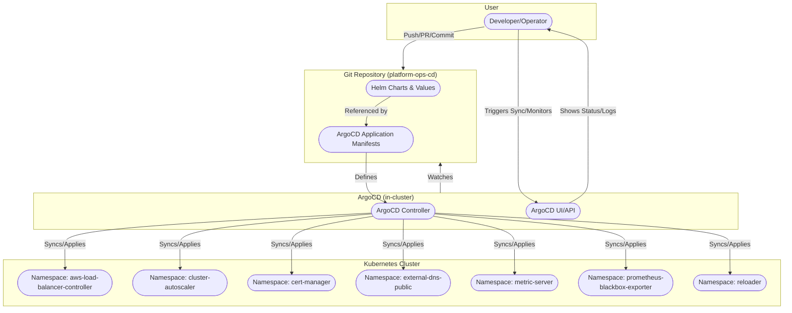

# Platform Operations CD - Kubernetes Infrastructure Deployment

This repository contains the infrastructure components and applications for a Kubernetes platform using ArgoCD for GitOps deployment.

## Architecture Overview

This platform includes the following core components:

- **AWS Load Balancer Controller** - Manages AWS Application Load Balancers
- **Cluster Autoscaler** - Automatically scales EKS node groups
- **Cert Manager** - SSL/TLS certificate management
- **External DNS Public** - DNS record management
- **Metrics Server** - Kubernetes metrics aggregation
- **Prometheus Blackbox Exporter** - External service monitoring
- **Reloader** - ConfigMap/Secret reloading

---

## Deployment Architecture Diagram



---

## System Structure Overview

The platform is organized into three main parts:

### 1. Application Services
These are your business microservices, typically managed as separate repositories and deployed via ArgoCD. Each service usually has its own namespace and Helm chart.
- **Examples:**
  - product-service
  - order-service
  - auth-service
  - api-gateway-service
  - notification-service

### 2. System Components
These are core infrastructure services required for the Kubernetes platform to operate reliably and securely.
- **Examples:**
  - cluster-autoscaler (automatic node scaling)
  - aws-load-balancer-controller (AWS ALB/NLB management)
  - cert-manager (certificate management)
  - external-dns-public (DNS automation)
  - reloader (auto-reload pods on config/secret change)

### 3. Observability Components
These provide monitoring, logging, and alerting for your platform and applications.
- **Examples:**
  - prometheus-blackbox-exporter (external endpoint monitoring)
  - fluent-bit (log collection and forwarding)
  - metrics-server (resource metrics for HPA and monitoring)

---

## Prerequisites

### Required Tools
- `kubectl` (v1.24+)
- `helm` (v3.8+)
- `argocd` CLI
- AWS CLI configured with appropriate permissions

### Required AWS Resources
- EKS cluster with OIDC provider
- IAM roles for service accounts (IRSA)
- Route53 hosted zone (for External DNS)
- S3 bucket for ArgoCD application state

### Required Kubernetes Resources
- ArgoCD installed in the cluster
- Namespace: `argo-cd` (for ArgoCD applications)

## Deployment Steps

### 1. Clone the Repository

```bash
git clone <your-repo-url>
cd platform-ops-cd
```

### 2. Configure Environment

The deployment supports multiple environments. Currently configured for `dev`:

```bash
# Check current environment configuration
cat infrastructure/dev/values-dev.yaml
```

### 3. Deploy Infrastructure

Deploy the main infrastructure application to ArgoCD:

```bash
# Apply the infrastructure application manifests
kubectl apply -f infrastructure/dev/templates/apps/

# Verify the application is created
kubectl get applications -n argo-cd
```

### 4. Monitor Deployment

Check the status of all applications:

```bash
# Check ArgoCD applications
argocd app list

# Sync all applications (example)
argocd app sync prometheus-blackbox-exporter
argocd app sync aws-load-balancer-controller
argocd app sync cluster-autoscaler
argocd app sync cert-manager
argocd app sync external-dns-public
argocd app sync metric-server
argocd app sync reloader
```

## Application Components

### AWS Load Balancer Controller
- **Purpose**: Manages AWS Application Load Balancers for Kubernetes services
- **Namespace**: `aws-load-balancer-controller`
- **Configuration**: See `applications/aws-load-balancer-controller/dev/values-dev.yaml`

### Cluster Autoscaler
- **Purpose**: Automatically scales EKS node groups based on pod scheduling
- **Namespace**: `cluster-autoscaler`
- **Configuration**: See `applications/cluster-autoscaler/dev/values-dev.yaml`

### Cert Manager
- **Purpose**: SSL/TLS certificate management using Let's Encrypt
- **Namespace**: `cert-manager`
- **Configuration**: See `applications/cert-manager/dev/values-dev.yaml`

### External DNS Public
- **Purpose**: Automatically creates DNS records for Kubernetes services
- **Namespace**: `external-dns-public`
- **Configuration**: See `applications/external-dns-public/dev/values-dev.yaml`

### Metrics Server
- **Purpose**: Provides metrics for `kubectl top` and HPA
- **Namespace**: `metric-server`
- **Monitoring**: Configured with health check annotations
- **Configuration**: See `applications/metrics-server/dev/values-dev.yaml`

### Prometheus Blackbox Exporter
- **Purpose**: External service monitoring and health checks
- **Namespace**: `prometheus-blackbox-exporter`
- **Security**: PodSecurity policy enabled
- **Configuration**: See `applications/prometheus-blackbox-exporter/dev/values-dev.yaml`

### Reloader
- **Purpose**: Automatically reloads pods when ConfigMaps/Secrets change
- **Namespace**: `reloader`
- **Configuration**: See `applications/reloader/dev/values-dev.yaml`

---

## Adding a New Application

To add a new application to the system, follow these steps:

1. **Create Application Directory**
   - Create a new directory under `applications/` with your application's name (e.g., `applications/my-new-app/`).
   - Inside, create an environment directory (e.g., `dev/`).

2. **Add Helm Chart and Values**
   - Place your Helm chart in `applications/my-new-app/dev/` (e.g., `Chart.yaml`, `charts/`, and `values-dev.yaml`).
   - Configure your `values-dev.yaml` as needed for your environment.

3. **Update ArgoCD Manifests**
   - In `infrastructure/dev/templates/apps/`, create a new ArgoCD Application manifest (e.g., `my-new-app.yaml`).
   - Example manifest:
     ```yaml
     apiVersion: argoproj.io/v1alpha1
     kind: Application
     metadata:
       name: my-new-app
       namespace: argo-cd
     spec:
       destination:
         namespace: my-new-app
         server: https://kubernetes.default.svc
       project: default
       source:
         path: applications/my-new-app/dev
         repoURL: <your-repo-url>
         targetRevision: HEAD
         helm:
           releaseName: my-new-app
           valueFiles:
             - values-dev.yaml
       syncPolicy:
         automated:
           prune: true
           selfHeal: true
     ```

4. **Apply and Sync with ArgoCD**
   - Apply the new manifest:
     ```bash
     kubectl apply -f infrastructure/dev/templates/apps/my-new-app.yaml
     ```
   - Sync the application in ArgoCD:
     ```bash
     argocd app sync my-new-app
     ```
   - Monitor the deployment:
     ```bash
     argocd app get my-new-app
     kubectl get pods -n my-new-app
     ```

---

### Adding a New Service Repository

To add a new microservice repository to the deployment system, simply add a new entry to the `applications` list in `infrastructure/app/dev/values-dev.yaml`. Each entry should specify:
- `name`: The application name
- `namespace`: The Kubernetes namespace for the service
- `path`: The Helm chart path (e.g., `helm-dev`)
- `repoURL`: The Git repository URL for the service

Example:

```yaml
applications:
  - name: payment-service
    namespace: payment-service-namespace
    path: helm-dev
    repoURL: https://github.com/your-org/payment-service-spring-boot
```

After updating the file, ArgoCD will detect the new application and deploy it automatically if configured for auto-sync.

---

## Configuration

### Environment Variables

Each application supports environment-specific configuration:

```yaml
# infrastructure/dev/values-dev.yaml
env: dev
argocdNamespace: argo-cd
```

### Application Values

Each application has its own `values-{env}.yaml` file with specific configurations:

- Resource limits and requests
- Replica counts
- Node selectors and tolerations
- Security contexts
- Monitoring annotations

## Security

### Pod Security Standards

Applications are configured with PodSecurity policies:

```yaml
# Example from prometheus-blackbox-exporter
apiVersion: policy/v1
kind: PodSecurity
metadata:
  name: restricted
  namespace: {{ .Release.Namespace }}
spec:
  policy: restricted
  enforce: true
  enforce-version: v1.24.0
  audit: true
  audit-version: v1.24.0
```

### IAM Roles for Service Accounts (IRSA)

Applications use AWS IAM roles for enhanced security:

```yaml
# Example service account annotation
serviceAccount:
  annotations:
    eks.amazonaws.com/role-arn: arn:aws:iam::<account>:role/dev-app-prometheus-blackbox-exporter-eks-irsa-role
```

## Monitoring

### Health Checks

Services are configured with monitoring annotations:

```yaml
# Example from metrics-server
service:
  annotations:
    monitoring/probe_httpservice_avaliable: "true"
    monitoring/probe_path: "/readyz"
```

### Resource Monitoring

All applications include resource limits and requests for proper cluster management.

## Troubleshooting

### Common Issues

1. **Application Sync Failed**
   ```bash
   argocd app logs <application-name>
   ```

2. **Pod Security Violations**
   ```bash
   kubectl get events -n <namespace>
   ```

3. **Resource Issues**
   ```bash
   kubectl describe pod -n <namespace>
   ```

### Useful Commands

```bash
# Check all applications status
argocd app list

# Sync specific application
argocd app sync <application-name>

# View application details
argocd app get <application-name>

# Check pod status
kubectl get pods -n <namespace>

# View logs
kubectl logs -n <namespace> <pod-name>
```

## Updates and Maintenance

### Updating Applications

1. **Update Helm Charts**: Modify the chart version in `Chart.yaml`
2. **Update Values**: Modify `values-{env}.yaml` files
3. **Sync**: ArgoCD will automatically sync changes or use `argocd app sync`

### Version Management

- **Chart Version**: Managed in `Chart.yaml` for each application
- **App Version**: Represents the actual application version
- **Helm Dependencies**: Stored in `charts/` directory
